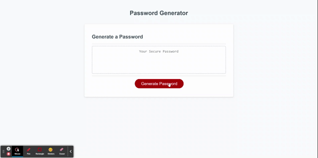

# Password Generator: first javascript project
This javascript password generator is meant to display a series of prompts and character limits, which when chosen, display a random password according to the criteria you selected. There were five parts that I needed to go through in order to achieve my finished result:

## Process
1. I needed create a pop-up prompt to appear when clicking generate password, and it needed to display a message of choosing character amount between 8 and 128. 
2. I needed to define the characters and create a series of conditional statements that would prop up alerts. If the character amount was not between 8 and 128, then the user would need choose a character amount within those numbers. 
3. If they did so, then new confirm messages would appear asking what types of characters they would like included. These would be new variables that would later be connected with variables that represented the characters.
4. Once these conditional statements were true, I needed to create a for loop that would calculate a password that included the chosen character amount, types of characters selected, and then randomize the order. 
5. After I figured out my for loop, I would give a return to a variable, which would be the finished password. 

## GIF and Link to app
Gif of website:

 

Link: https://dylankreisman.github.io/first-javascript/
